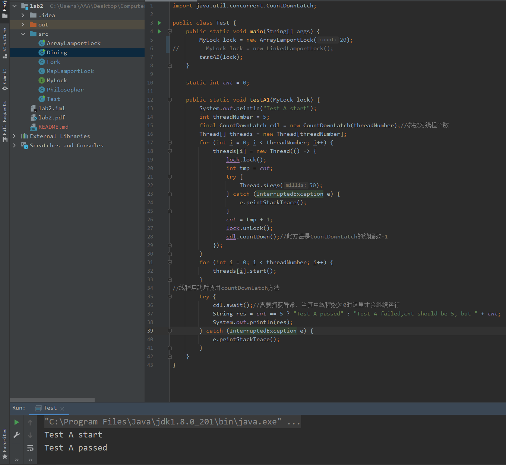

# CSE Lab2文档

19302010020 袁逸聪

## PartA

实现锁采用了面包房算法

对于每个申请锁的线程，算法记录一个表示正在取号的布尔值和一个号码值

加锁分为以下几步：

1. 取号
   1. 表明正在取号
   2. 记录递增号码值
   3. 表明取号完毕
2. 等待叫号
   1. 遍历线程池，等号码更小的线程执行
   2. 如果号码一样（并发可能发生），则等线程id更小的线程执行
3. 加锁成功

解锁则简单得多：

1. 归还所取号

### 对算法正确性的理解

正确加锁的关键在于如何在并发场景下正确衡量线程对锁的请求，避免出现诸如同时获取锁的情况：

- 线程A查看锁，发现空闲；再线程A获取锁之前，线程B也发现锁空闲，准备获取锁

要解决这个问题，需要让B能够知道，A已经在试图获得锁了

取号排队即是这样一个过程，每个线程先表明了自己的加锁意愿（加锁），以阻止其他线程，而后才真正把锁取走

### 实现

面包房房算法中，假设每个可能的线程，都存在对应的记录空间

然而，获取线程id时，id并不像自然数那样从零开始且紧密地排列

我提供了两种实现，各有局限性，但都足以完成本次lab的任务

ArrayLamportLock中，用于记录的空间大小需要在初始化时声明，且这个空间必须足够作为最大加锁线程的索引

在运行过程中，发现5位哲学家的线程id不超过20，设置20为初始大小可以通过测试

然而，锁在实际使用过程中，id的数量可能难以或者。太大则降低效率（取号、等待都需要不断遍历），太小则可能不够索引

MapLamportLock中，则用HashMap将线程id映射为自然数，避免浪费空间，且能够自适应id范围

但是，多线程场景下需要使用ConcurrentHashMap保证线程安全，用线程安全的数据结构实现锁，可以说是脱裤子放屁，显然也不理想

不过，本次lab的重点应该不是开发一个工程上适用的锁，理解原理加以实现即可，所以暂时先不继续探究。相比之下或许为ArrayLamportLock设置默认的较大容量比较符合题意



## PartB

模拟中，出于方便，让Fork类继承了上述实现的锁，成为不能被多个线程同时使用的资源

哲学家吃饭问题中，所有哲学家同时拿起听一边的叉子时形成死锁

所以只要保证避免这种情况，就可以正常运行

只要为所有叉子编号，每个哲学家先拾取编号小的叉子即可

因为不论是左边还是右边的哲学家，都会先拾取编号最小的叉子。保证至少有一对哲学家，最初的拾取方向是不同的，也就使得所有哲学家都选取左边或都选取右边造成死锁的情况不再可能

截图截不下，给出吃10份食物的控制台输出

```java
Philosopher0 5854914007800: Thinking
Philosopher1 5854914549800: Thinking
Philosopher2 5854914949900: Thinking
Philosopher3 5854915208900: Thinking
Philosopher4 5854915363200: Thinking
Philosopher0 5854998517300: Pick up left fork
Philosopher1 5855003724900: Pick up left fork
Philosopher3 5855007708000: Pick up left fork
Philosopher2 5855009693200: Pick up left fork
Philosopher3 5855083785200: Pick up right fork
Philosopher3 5855094741400: Eating
还剩9份食物
Philosopher3 5855099891800: Put down left fork
Philosopher3 5855115758900: Put down right fork
Philosopher2 5855117715900: Pick up right fork
Philosopher2 5855138686300: Eating
还剩8份食物
Philosopher2 5855142738400: Put down left fork
Philosopher3 5855144689200: Thinking
Philosopher2 5855190747900: Put down right fork
Philosopher1 5855192744000: Pick up right fork
Philosopher1 5855219704400: Eating
Philosopher2 5855273726800: Thinking
Philosopher3 5855275684200: Pick up left fork
还剩7份食物
Philosopher1 5855296804800: Put down left fork
Philosopher3 5855303739700: Pick up right fork
Philosopher1 5855313754800: Put down right fork
Philosopher0 5855313770900: Pick up right fork
Philosopher3 5855385731300: Eating
Philosopher1 5855392751500: Thinking
Philosopher2 5855394691700: Pick up left fork
Philosopher0 5855404736600: Eating
还剩6份食物
Philosopher3 5855457794800: Put down left fork
还剩5份食物
Philosopher0 5855480763300: Put down left fork
Philosopher0 5855481717500: Put down right fork
Philosopher4 5855482684900: Pick up right fork
Philosopher3 5855488731100: Put down right fork
Philosopher2 5855490715100: Pick up right fork
Philosopher2 5855492693500: Eating
Philosopher0 5855544701600: Thinking
Philosopher1 5855545811300: Pick up left fork
Philosopher3 5855579751300: Thinking
Philosopher4 5855580683900: Pick up left fork
还剩4份食物
Philosopher2 5855582750300: Put down left fork
Philosopher4 5855660730300: Eating
Philosopher2 5855674850000: Put down right fork
Philosopher1 5855675690800: Pick up right fork
还剩3份食物
Philosopher4 5855706781100: Put down left fork
Philosopher2 5855746777300: Thinking
Philosopher3 5855747682600: Pick up left fork
Philosopher1 5855749690500: Eating
Philosopher4 5855750744900: Put down right fork
Philosopher4 5855772820100: Thinking
Philosopher0 5855774686200: Pick up left fork
还剩2份食物
Philosopher1 5855779875100: Put down left fork
Philosopher3 5855793774700: Pick up right fork
Philosopher3 5855832682800: Eating
Philosopher1 5855850721100: Put down right fork
Philosopher0 5855852725300: Pick up right fork
Philosopher1 5855873886000: Thinking
Philosopher2 5855874707900: Pick up left fork
还剩1份食物
Philosopher3 5855928839000: Put down left fork
Philosopher0 5855930749800: Eating
Philosopher3 5855944713300: Put down right fork
Philosopher2 5855945778800: Pick up right fork
Philosopher2 5855963732200: Eating
Philosopher3 5855979843500: Thinking
还剩0份食物
```
